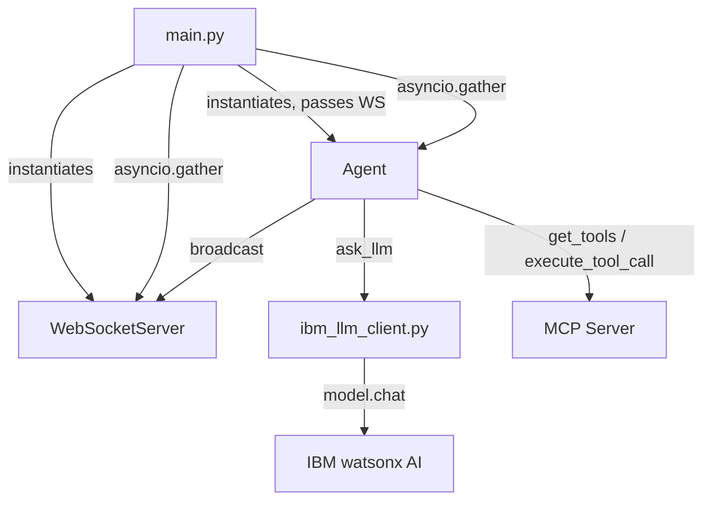
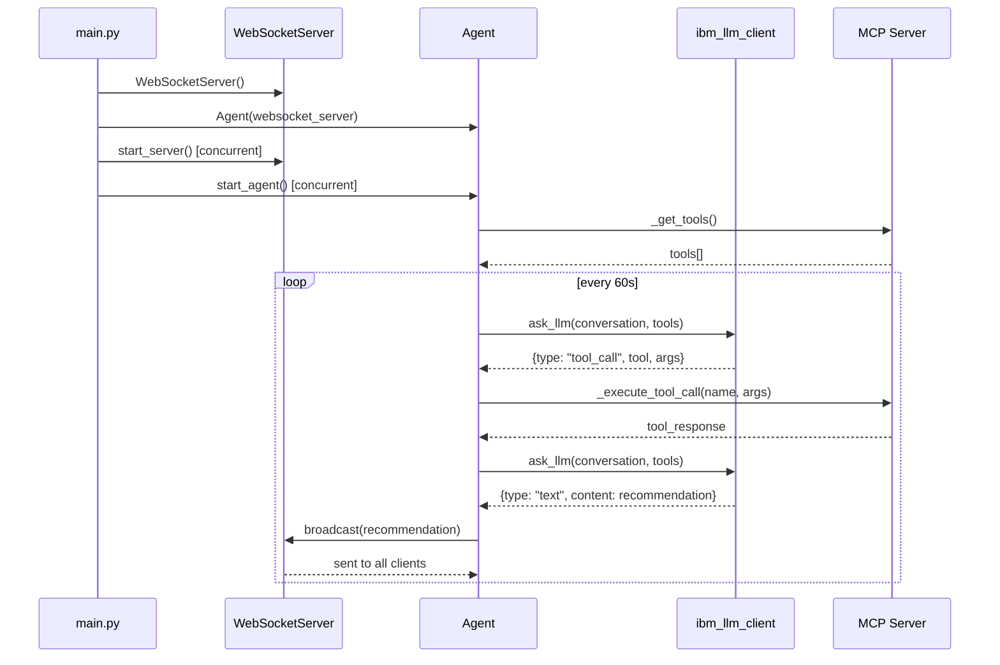

# IBM-Skillsbuild-2026

## Architecture

### Component Overview

```mermaid
graph TD
    Main[main.py] -->|instantiates| WS[WebSocketServer]
    Main -->|instantiates, passes WS| A[Agent]
    Main -->|asyncio.gather| A
    Main -->|asyncio.gather| WS
    A -->|ask_llm| LLM[ibm_llm_client.py]
    A -->|get_tools / execute_tool_call| MCP[MCP Server]
    A -->|broadcast| WS
    LLM -->|model.chat| IBM[IBM watsonx AI]
```

### Runtime Flow

```mermaid
sequenceDiagram
    participant Main as main.py
    participant WS as WebSocketServer
    participant A as Agent
    participant LLM as ibm_llm_client
    participant MCP as MCP Server

    Main->>WS: WebSocketServer()
    Main->>A: Agent(websocket_server)
    Main->>WS: start_server() [concurrent]
    Main->>A: start_agent() [concurrent]

    A->>MCP: _get_tools()
    MCP-->>A: tools[]

    loop every 60s
        A->>LLM: ask_llm(conversation, tools)
        LLM-->>A: {type: "tool_call", tool, args}
        A->>MCP: _execute_tool_call(name, args)
        MCP-->>A: tool_response
        A->>LLM: ask_llm(conversation, tools)
        LLM-->>A: {type: "text", content: recommendation}
        A->>WS: broadcast(recommendation)
        WS-->>A: sent to all clients
    end
```
